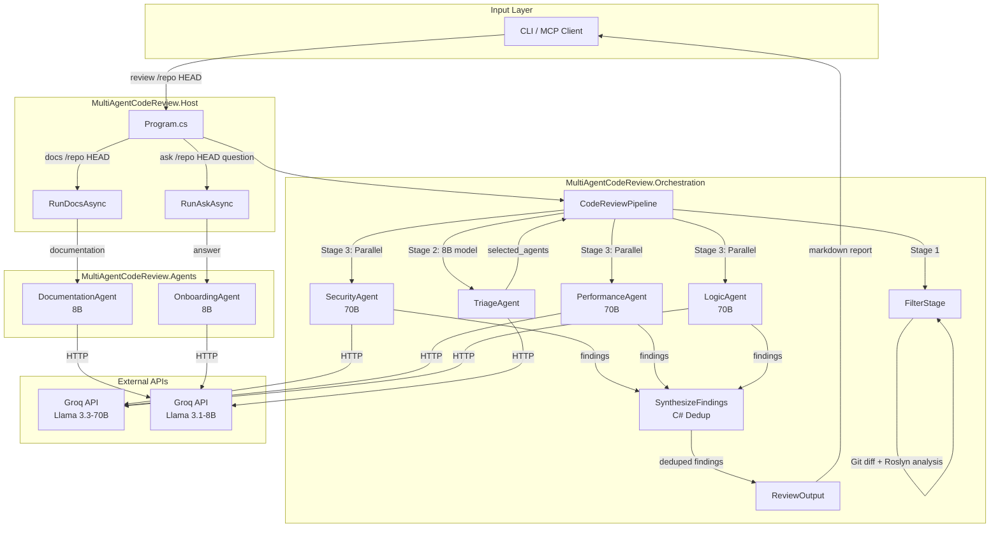
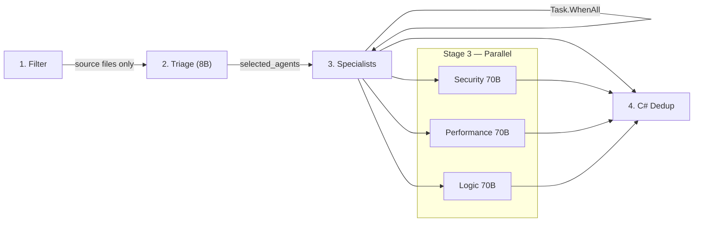
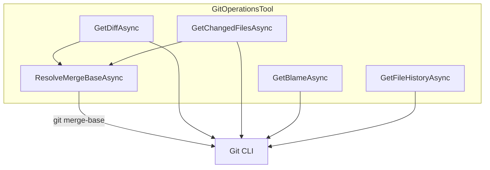
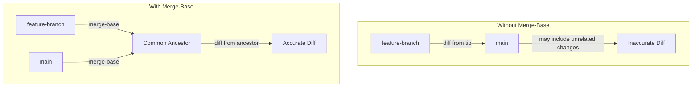
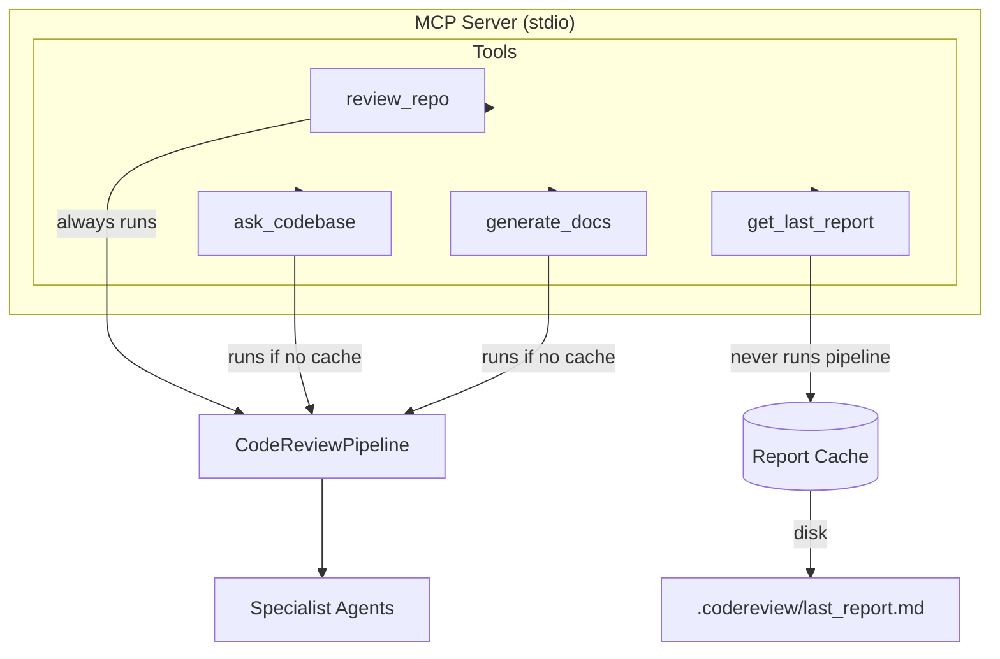

# Multi-Agent Code Review System

> **Intelligent, automated code review powered by multi-agent AI**

A production-grade multi-agent code review system built with Microsoft AutoGen and Groq's Llama models. Analyzes C# projects with specialized agents for security, performance, and logic analysis. Exposed as an **MCP server** for seamless integration with OpenCode, VS Code, Claude Desktop, and other MCP clients.

---

## Architecture Mind Map



---

## System Architecture

### Project Dependency Graph

```
MultiAgentCodeReview.Core          (no dependencies)
    ↑
MultiAgentCodeReview.Agents        (references Core)
    ↑
MultiAgentCodeReview.Orchestration (references Core + Agents)
    ↑
    ├── MultiAgentCodeReview.Host        (references Orchestration)
    └── MultiAgentCodeReview.McpServer   (references Orchestration + Agents)
```

### Projects

| Project | Purpose | Key Files |
|---------|---------|-----------|
| `MultiAgentCodeReview.Core` | Domain models, interfaces, config, prompts, rate limiting | `IAgent.cs`, `Finding.cs`, `PipelineContext.cs`, `AgentPrompts.cs` |
| `MultiAgentCodeReview.Agents` | AutoGen agents (Triage, 3 Specialists, Docs, Onboarding) | `TriageAgent.cs`, `SpecialistAgents.cs`, `AgentFactory.cs` |
| `MultiAgentCodeReview.Orchestration` | DI container, pipeline orchestrator, Roslyn/Git tools | `CodeReviewPipeline.cs`, `FilterStage.cs`, `GitOperationsTool.cs` |
| `MultiAgentCodeReview.Host` | Console entry point (CLI commands) | `Program.cs` |
| `MultiAgentCodeReview.McpServer` | MCP server exposing tools via stdio transport | `Program.cs`, `CodeReviewMcpTools.cs` |

---

## Agents

| Agent | Role | Model | Speed |
|-------|------|-------|-------|
| **Triage** | Classifies changes, routes to specialists | llama-3.1-8b-instant | 2-3s |
| **Security** | SQLi, XSS, auth bypass, crypto, secrets | llama-3.3-70b-versatile | 2-3s |
| **Performance** | N+1, blocking calls, memory, O(n²), caching | llama-3.3-70b-versatile | 2-3s |
| **Logic** | Logic errors, SOLID violations, complexity, code smells | llama-3.3-70b-versatile | 2-3s |
| **Documentation** | Generates README, API docs, Architecture | llama-3.1-8b-instant | 4-5s |
| **Onboarding** | Answers developer questions from codebase context | llama-3.1-8b-instant | 3-4s |

---

## Pipeline Stages



### Stage Details

| Stage | What it does | Key implementation |
|-------|-------------|-------------------|
| **Filter** | Git diff + Roslyn dependency graph → source files only | `FilterStage.cs` — excludes `.md`, `.json`, `.xml`, etc. |
| **Triage** | 8B model classifies diff, routes to 1-3 specialists | `TriageAgent.cs` — outputs `{"selected_agents":[...]}` |
| **Specialists** | 3 agents run in parallel via `Task.WhenAll` | Each agent works on the 70B model through Groq API |
| **Dedup** | C# code merges findings, boosts cross-agent agreement | `CodeReviewPipeline.cs` — no LLM call needed |

---

## Key Functions

### GitOperationsTool



| Function | Description | Returns |
|----------|-------------|---------|
| `GetDiffAsync(fromRef, toRef)` | Gets unified diff between two refs, resolved through merge-base | `GitDiff` |
| `GetChangedFilesAsync(fromRef, toRef)` | Lists changed files between two refs, resolved through merge-base | `List<string>` |
| `GetBlameAsync(filePath)` | Gets blame info for a file (first 1000 lines) | `List<BlameLine>` |
| `GetFileHistoryAsync(filePath, limit)` | Gets commit history for a file | `List<Commit>` |
| `ResolveMergeBaseAsync(fromRef, toRef)` | Resolves common ancestor between two refs | `string` |

### CodeAnalysisTool (Roslyn)

| Function | Description | Returns |
|----------|-------------|---------|
| `GetCyclomaticComplexityAsync(filePath, methodName)` | Calculates cyclomatic complexity | `int` |
| `GetDependencyGraphAsync(filePath)` | Builds dependency graph from usings/type refs | `DependencyGraph` |
| `FindCallersAsync(filePath, methodName)` | Finds all callers of a method | `List<CallSite>` |
| `DetectCodeSmellsAsync(filePath)` | Detects code smells (long methods, large classes, etc.) | `List<CodeSmell>` |

### AgentFactory

| Function | Description | Returns |
|----------|-------------|---------|
| `CreateTriageAgent()` | Creates triage agent with 8B model | `ITriageAgent` |
| `CreateSecurityAgent()` | Creates security specialist with 70B model | `ISpecialistAgent` |
| `CreatePerformanceAgent()` | Creates performance specialist with 70B model | `ISpecialistAgent` |
| `CreateLogicAgent()` | Creates logic specialist with 70B model | `ISpecialistAgent` |
| `CreateDocumentationAgent()` | Creates documentation agent with 8B model | `IDocumentationAgent` |
| `CreateOnboardingAgent()` | Creates onboarding agent with 8B model | `IOnboardingAgent` |

---

## Merge-Base Resolution

The system automatically resolves refs to their common ancestor before computing diffs. This ensures accurate diffs even when comparing branches with complex merge histories.

### How It Works



### Implementation

```csharp
private async Task<string> ResolveMergeBaseAsync(string fromRef, string toRef)
{
    try
    {
        var output = await RunGitCommandAsync($"merge-base {fromRef} {toRef}");
        if (!string.IsNullOrWhiteSpace(output))
            return output.Trim();
    }
    catch (Exception ex)
    {
        Console.Error.WriteLine($"[GitOperationsTool] merge-base failed, falling back to fromRef: {ex.Message}");
    }
    return fromRef;
}
```

### Behavior

- **Normal case**: Resolves `fromRef` to the common ancestor of `fromRef` and `toRef`
- **Fallback**: If `git merge-base` fails, uses `fromRef` as-is (logs warning)
- **Transparency**: All callers (`FilterStage`, MCP tools) benefit automatically

---

## Agent-Computer Interface (ACI)

The pipeline injects absolute line numbers into diff content before sending to specialists:

```
# Raw git diff (LLM must count lines):
@@ -40,4 +40,5 @@
  public void ProcessData(string userInput) {
-     RunQuery(userInput);
+     db.Execute($"SELECT * FROM Users WHERE Name = '{userInput}'");

# Injected line numbers (LLM copies directly):
[Line 40]  public void ProcessData(string userInput) {
[-]         -     RunQuery(userInput);
[Line 41]  +     db.Execute($"SELECT * FROM Users WHERE Name = '{userInput}'");
```

Specialists are instructed to use `<thinking>` tags before outputting JSON, ensuring accurate line number extraction.

---

## MCP Tools



| Tool | Description | When to use |
|------|-------------|-------------|
| `review_repo` | Run full multi-agent code review | "Review this commit", "Check this PR" |
| `ask_codebase` | Ask natural language questions | "Where is auth handled?", "What calls X?" |
| `get_last_report` | Get cached review report | "Show me the previous review" |
| `generate_docs` | Generate project documentation | "Generate docs", "Create README" |

---

## Quick Start

### Option 1: CLI

```bash
# 1. Clone and build
git clone https://github.com/bhavyananda17/MultiAgentCodeReview.git
cd MultiAgentCodeReview
dotnet build

# 2. Configure
cp .env.example .env
# Edit .env and add your GROQ_API_KEY

# 3. Run review
dotnet run --project MultiAgentCodeReview.Host -- review <repo-path> <commit-hash> [base-commit]

# 4. Run docs
dotnet run --project MultiAgentCodeReview.Host -- docs <repo-path> <commit-hash> [base-commit]
```

### Option 2: MCP Server (OpenCode)

```bash
# 1. Build
dotnet build MultiAgentCodeReview.McpServer

# 2. Add to opencode.json (see MCP_SETUP.md for details)
# 3. Restart OpenCode and use the tools
```

See [MCP_SETUP.md](MCP_SETUP.md) for detailed MCP configuration.

---

## Configuration

All settings via environment variables (prefix `MULTIAGENT_`):

| Variable | Description | Default |
|----------|-------------|---------|
| `GROQ_API_KEY` | **Required** Groq API key | — |
| `GROQ_BASE_URL` | Groq OpenAI-compatible endpoint | `https://api.groq.com/openai` |
| `MODEL_<ROLE>` | Override model per role (e.g., `MODEL_SECURITY`) | Role-specific |
| `MODEL_<ROLE>_TEMP` | Temperature override | Role-specific |
| `MODEL_<ROLE>_TOKENS` | Max tokens override | Role-specific |

Example `.env`:
```bash
GROQ_API_KEY=gsk_xxx
GROQ_BASE_URL=https://api.groq.com/openai
MODEL_TRIAGE=llama-3.1-8b-instant
```

---

## Performance

| Metric | Value |
|--------|-------|
| Total LLM calls | 4 (triage + 3 specialists) |
| Specialist execution | Parallel via `Task.WhenAll` |
| Triage model | 8B (fast, cheap) |
| Synthesis | C# dedup (<1ms) |
| Wall time | ~8-14s |

---

## Status

**Working pipeline** — Core pipeline functional with parallel execution, accurate line numbers, and cross-agent deduplication.

### Known gaps
- Rate limiting infrastructure built but not fully wired
- RAG/knowledge search interfaces defined but unimplemented
- Roslyn analysis limited to C# projects
- Python/Ruff integration planned but not started
