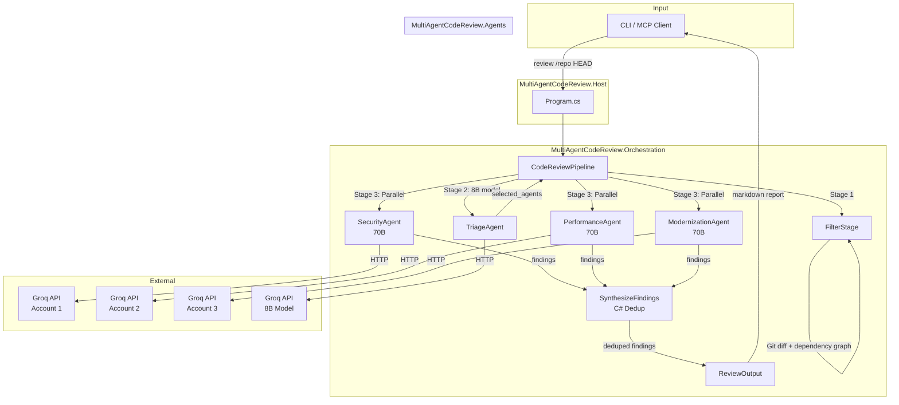
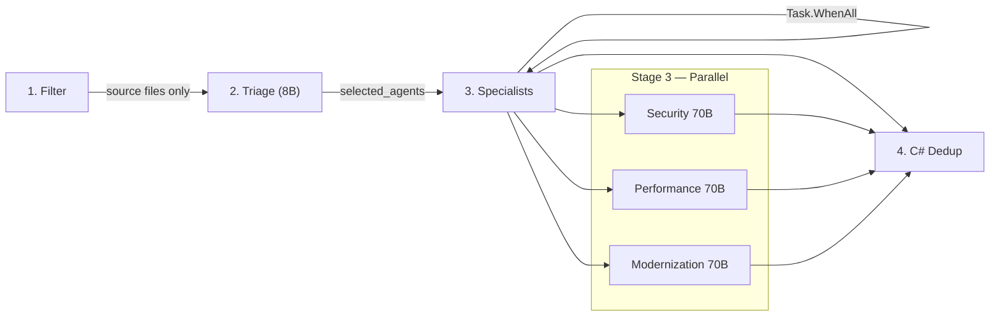

# Multi-Agent Code Review System

A multi-agent code review system built with Microsoft AutoGen and Groq's Llama models. Automated code review pipeline with specialized agents for security, performance, and modernization analysis. Exposed as an **MCP server** for integration with OpenCode, VS Code, Claude Desktop, and other MCP clients.

## Architecture



### Projects

| Project | Purpose |
|---------|---------|
| `MultiAgentCodeReview.Core` | Domain models, interfaces, config, prompts, rate limiting |
| `MultiAgentCodeReview.Agents` | AutoGen agents (Triage, 3 Specialists, Docs, Onboarding) |
| `MultiAgentCodeReview.Orchestration` | DI container, pipeline orchestrator, Roslyn/Git tools |
| `MultiAgentCodeReview.Host` | Console entry point (CLI commands) |
| `MultiAgentCodeReview.McpServer` | MCP server exposing tools via stdio transport |

## Agents

| Agent | Role | Model |
|-------|------|-------|
| **Triage** | Classifies changes, routes to specialists | llama-3.1-8b-instant |
| **Security** | SQLi, XSS, auth bypass, crypto, secrets | llama-3.3-70b-versatile |
| **Performance** | N+1, blocking calls, memory, O(n²), caching | llama-3.3-70b-versatile |
| **Modernization** | Logic errors, SOLID violations, legacy patterns, outdated C# features | llama-3.3-70b-versatile |
| **Documentation** | Generates README, API docs, Architecture | llama-3.1-8b-instant |
| **Onboarding** | Answers developer questions from codebase context | llama-3.1-8b-instant |

> Logic and Modernization agents were consolidated into a single Modernization agent. Synthesis was replaced by C# deduplication.

## Pipeline Stages



### Stage Details

| Stage | What it does | Key implementation |
|-------|-------------|-------------------|
| **Filter** | Git diff + Roslyn dependency graph → source files only | `FilterStage.cs` — excludes `.md`, `.json`, `.xml`, etc. |
| **Triage** | 8B model classifies diff, routes to 1-3 specialists | `TriageAgent.cs` — outputs `{"selected_agents":[...]}` |
| **Specialists** | 3 agents run in parallel via `Task.WhenAll` | Each agent gets its own Groq API key for true parallelism |
| **Dedup** | C# code merges findings, boosts cross-agent agreement | `CodeReviewPipeline.cs` — no LLM call needed |

### Agent-Computer Interface (ACI)

The pipeline injects absolute line numbers into diff content before sending to specialists:

```
# Raw git diff (LLM must count lines):
@@ -40,4 +40,5 @@
  public void ProcessData(string userInput) {
-     RunQuery(userInput);
+     db.Execute($"SELECT * FROM Users WHERE Name = '{userInput}'");

# Injected line numbers (LLM copies directly):
[Line 40]  public void ProcessData(string userInput) {
[-]         -     RunQuery(userInput);
[Line 41]  +     db.Execute($"SELECT * FROM Users WHERE Name = '{userInput}'");
```

Specialists are instructed to use `<thinking>` tags before outputting JSON, ensuring accurate line number extraction.

## Quick Start

### Option 1: CLI

```bash
# 1. Clone and build
git clone https://github.com/bhavyananda17/multi_agent_code_reviewsystem-hclfinalproject-.git
cd multi_agent_code_reviewsystem-hclfinalproject-
dotnet build

# 2. Configure
cp .env.example .env
# Edit .env and add your GROQ_API_KEY

# 3. Run review
dotnet run --project MultiAgentCodeReview.Host -- review <repo-path> <commit-hash> [base-commit]

# 4. Run docs
dotnet run --project MultiAgentCodeReview.Host -- docs <repo-path> <commit-hash> [base-commit]
```

### Option 2: MCP Server (OpenCode)

```bash
# 1. Build
dotnet build MultiAgentCodeReview.McpServer

# 2. Add to opencode.json (see MCP_SETUP.md for details)
# 3. Restart OpenCode and use the tools
```

See [MCP_SETUP.md](MCP_SETUP.md) for detailed MCP configuration.

## MCP Tools

| Tool | Description |
|------|-------------|
| `review_repo` | Run full multi-agent code review |
| `ask_codebase` | Ask natural language questions about the codebase |
| `get_last_report` | Get cached review report |
| `generate_docs` | Generate project documentation |

## Configuration

All settings via environment variables (prefix `MULTIAGENT_`):

| Variable | Description | Default |
|----------|-------------|---------|
| `GROQ_API_KEY` | **Required** Groq API key | — |
| `GROQ_BASE_URL` | Groq OpenAI-compatible endpoint | `https://api.groq.com/openai` |
| `MODEL_<ROLE>` | Override model per role (e.g., `MODEL_SECURITY`) | Role-specific |
| `MODEL_<ROLE>_TEMP` | Temperature override | Role-specific |
| `MODEL_<ROLE>_TOKENS` | Max tokens override | Role-specific |

Example `.env`:
```bash
GROQ_API_KEY=gsk_xxx
GROQ_BASE_URL=https://api.groq.com/openai
MODEL_TRIAGE=llama-3.1-8b-instant
```

## Performance

| Metric | Before | After |
|--------|--------|-------|
| Total LLM calls | 6 (triage + 4 specialists + synthesis) | 4 (triage + 3 specialists) |
| Specialist execution | Sequential + 2s delay | Parallel via `Task.WhenAll` |
| Triage model | 70B (overkill for routing) | 8B (fast, cheap) |
| Synthesis | LLM call (~5-8s) | C# dedup (<1ms) |
| Wall time | ~30-40s | ~8-10s |

## Status

**Working pipeline** — Core pipeline functional with parallel execution, accurate line numbers, and cross-agent deduplication.

Known gaps:
- Rate limiting infrastructure built but not fully wired
- RAG/knowledge search interfaces defined but unimplemented
- Roslyn analysis limited to C# projects
- No tests yet

## License

MIT
